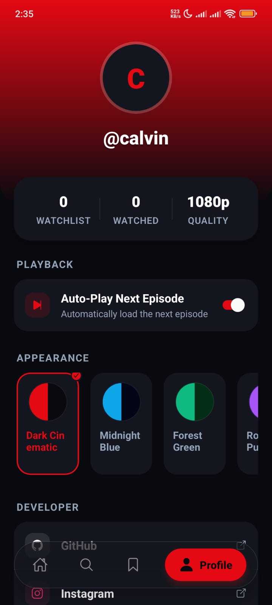
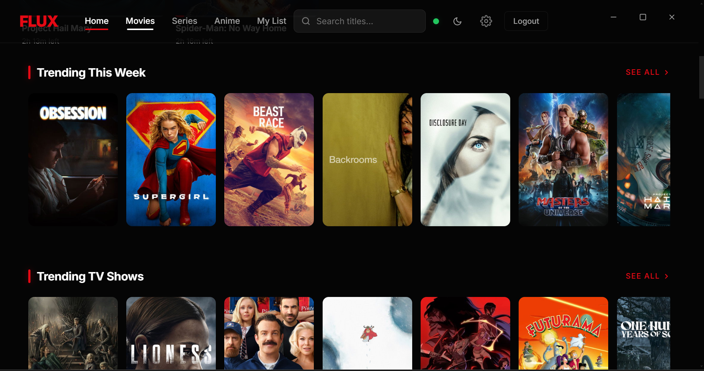

# Flux-Releases

Welcome to the **FLUX Ecosystem Releases** repository. This is the central hub for hosting the final, compiled, and stable applications and software for the FLUX ecosystem. Here you will find ready-to-use binaries and executables for both Desktop and Mobile platforms.

## 🚀 Latest Releases (v1.0.0)

We are excited to announce our initial release (v1.0.0)! 

### 📱 Flux Mobile

Experience FLUX on the go. 

- **Version**: v1.0.0
- **Date**: August 8, 2026
- **Release Notes**: Initial release of the Flux Mobile app.
- **Download**: [📥 Download APK](https://github.com/wadecalvin9/Flux-Releases/releases/download/v1.0.0/Flux-v1.0.0-app-release.apk)

#### Mobile Screenshots

  
  
  

---

### 💻 Flux Desktop

Unleash the full power of FLUX on your desktop.

- **Version**: v1.0.0
- **Date**: August 8, 2026
- **Release Notes**: Initial release of the Flux Desktop application.
- **Download**: [📥 Download Installer](https://github.com/wadecalvin9/Flux-Releases/releases/download/v1.0.0/Flux.Setup.1.0.0.exe)

#### Desktop Screenshots

  
    
  
    
  

---

## 🎯 Purpose

- **Final Releases**: Download the latest stable versions of our applications.
- **Flux Software**: Central hub for all Flux ecosystem binaries and executables.

